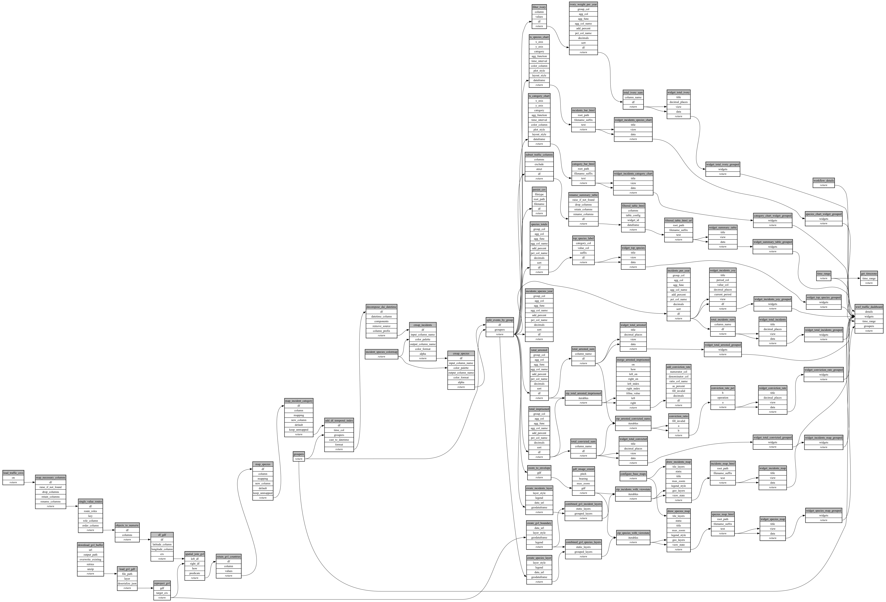

```
# AUTOGENERATED BY ECOSCOPE-WORKFLOWS; see fingerprint in README.md for details

```

```yaml
# fingerprint:
artifacts_sha256_basic: 6931848b795cf20add00a0972c85c0e77c6518fd0f3176b34b64128d877c5bc6
artifacts_sha256_strict: c85a84f538a1b56bfec1c8dca44260d6091734190697fe4f9ca2a1142b1dba69
installed_requirements:
- channel: https://repo.prefix.dev/ecoscope-workflows/
  name: ecoscope-platform
  version: {version: ==2.15.1}
- channel: https://repo.prefix.dev/ecoscope-workflows-custom/
  name: ecoscope-workflows-ext-custom
  version: {version: ==0.1.0rc14}
- channel: https://repo.prefix.dev/ecoscope-workflows-custom/
  name: ecoscope-workflows-ext-ste
  version: {version: ==0.0.0rc1}
- channel: https://repo.prefix.dev/ecoscope-workflows-custom/
  name: ecoscope-workflows-ext-wwf-virunga
  version: {version: ==0.0.0rc1}
- channel: conda-forge
  name: pydeck
  version: {version: ==0.9.2}
- channel: conda-forge
  name: opentelemetry-sdk
  version: {version: ==1.44.0}
params_sha256: 9d7d2739d67e15d7f7924477e40def89079bc83172a2f34182c199aa6e7f4353
spec_sha256: 5f0bcbbb0457a021550cc6759094f56fac70728bbbaec5c8a6e4fb9a091cdeb2

```

# ecoscope-workflows-wwf-traffic-workflow


