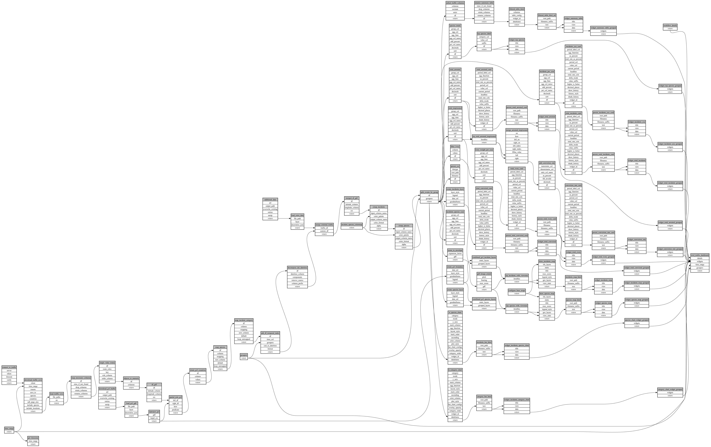

```
# AUTOGENERATED BY ECOSCOPE-WORKFLOWS; see fingerprint in README.md for details

```

```yaml
# fingerprint:
artifacts_sha256_basic: 91a8c3192b97ddc1fd3c8e4e62046b517e4ae529f27d55ddeec8014bcc3e4848
artifacts_sha256_strict: ca461fbd9ce447b91536dfb1cf45739be14aad3185ae282078fbb3b658455b8e
installed_requirements:
- channel: https://repo.prefix.dev/ecoscope-workflows/
  name: ecoscope-platform
  version: {version: ==2.15.1}
- channel: https://repo.prefix.dev/ecoscope-workflows-custom/
  name: ecoscope-workflows-ext-custom
  version: {version: ==0.1.0rc14}
- channel: https://repo.prefix.dev/ecoscope-workflows-custom/
  name: ecoscope-workflows-ext-ste
  version: {version: ==0.0.0rc1}
- channel: https://repo.prefix.dev/ecoscope-workflows-custom/
  name: ecoscope-workflows-ext-wwf-virunga
  version: {version: ==0.0.5}
- channel: conda-forge
  name: pydeck
  version: {version: ==0.9.2}
- channel: conda-forge
  name: opentelemetry-sdk
  version: {version: ==1.45.0}
params_sha256: 433a72ab499f7e983ecdf6059bada751903303aa4891ec9adee450339ec66702
spec_sha256: 1cc735147af9209687f6ff11e68214de1f76997d52f6460791fd1f9bc8f9cfa3

```

# ecoscope-workflows-wwf-traffic-workflow


